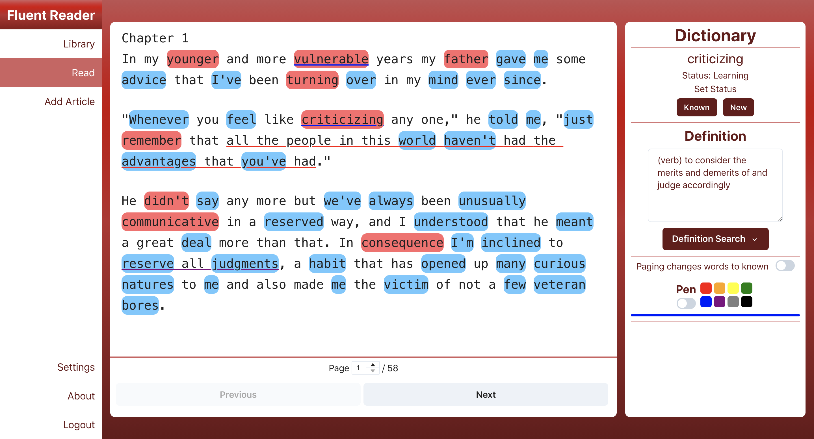

# Fluent Reader

Fluent Reader is a free, open-source web application for assisted reading of articles, books, or other material written in foreign languages. When reading things in another language, it's common to run into words or expressions that we don't know, but it can be annoying to constantly need to search for definitions online manually. Fluent Reader helps remedy this by automating this process. Users can easily search up definitions of words that they don't know from a list of different online dictionaries automatically and record statuses of individual words, which is used to determine the number of words in the foreign language that users know, as well as the number and percentage of known (or unknown) words in new articles.

-   **Technology stack**: The frontend is written in Typescript with React, and the backend is written in Rust with Actix Web.
-   **Status**: Fluent Reader is currently in a very early Alpha state. It is usable, but contains many limitations and lacks many potential features.
-   Fluent Reader is currently live [https://fluentreader.cc](https://fluentreader.cc). Note that the server is located in China, so you may experience slower load times in places that are farther away.

Below is the reader page in the app.

Words that the user has not seen or marked before in the app are highlighted in blue, meaning "new", words that the user has seen before but doesn't fully know yet are highlighted in red, meaning "learning", and words that the user has marked as knowing are not highlighted.

On the right side is the dictionary, where the user can look up words, save definitions for them, and set the current status of a particular word.

## Features

-   Support for reading English texts
-   Import any article by pasting text
-   Find public articles published officially on Fluent Reader (System Library) and articles published by other users (All User Articles Library)
-   Save articles from the "System" or "All User" libraries to "Saved" library
-   Highlight words in different colors based on status (New: Blue, Learning: Red, Known: No Color)
-   Change word status on demand
-   Search for word definitions in a new tab in one click
-   Save custom definitions for different words
-   Underline words or phrases in different colors with the Pen tool
-   Set all "new" words on a page to "known" by moving to the next page with "Paging changes words to known" setting
-   UI in English and Chinese

## Getting help

If you need help with using Fluent Reader, feel free to contact me at [xoen000@163.com](mailto::xoen000@163.com) in English or Chinese.

If you have questions, concerns, bug reports, etc, please file an issue in this repository's Issue Tracker.

## Dependencies

To be run locally, the frontend requires [Node.js](https://nodejs.org/) and [Yarn](https://yarnpkg.com/) to be installed. The backend requries [Rust](https://www.rust-lang.org/).

## Installation

### Frontend

The frontend was bootstrapped with [Create React App](https://create-react-app.dev/), so the following steps can get the frontend running locally:

-   In the root directory of the frontend, run `yarn install`
-   `yarn start`

### Backend

The following steps can get the backend running locally:

-   In the root directory of the backend, run `yarn install`
-   `yarn start`

Note: The backend uses a `package.json` with `yarn` for the `start` script and `lint-staged`/`husky`, to allow for pre-commit formatting. The `yarn start` script runs `cargo watch`, so the code will be recompiled on save.

## License

Both the frontend and backend code for Fluent Reader are licensed under the GNU General Public License (Version 3).
