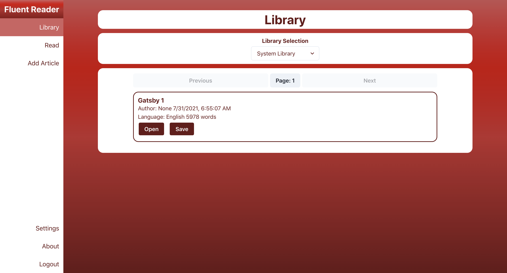
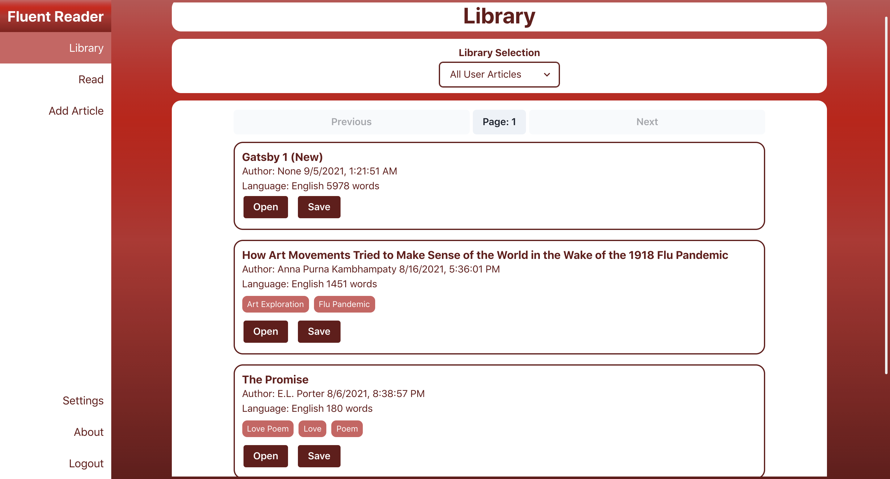
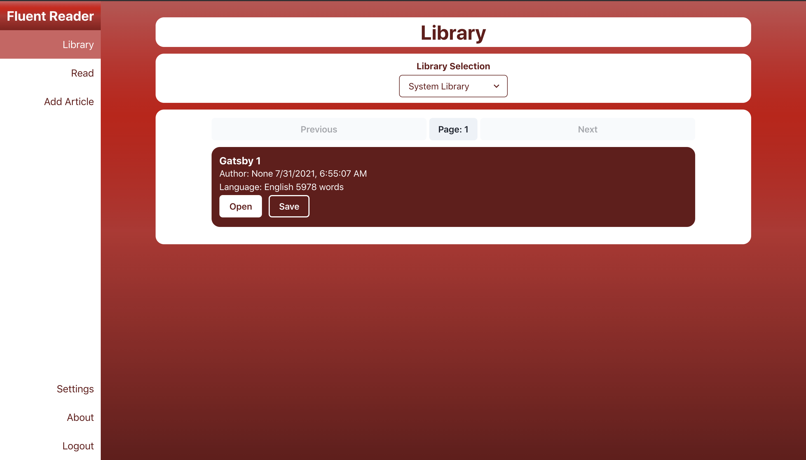
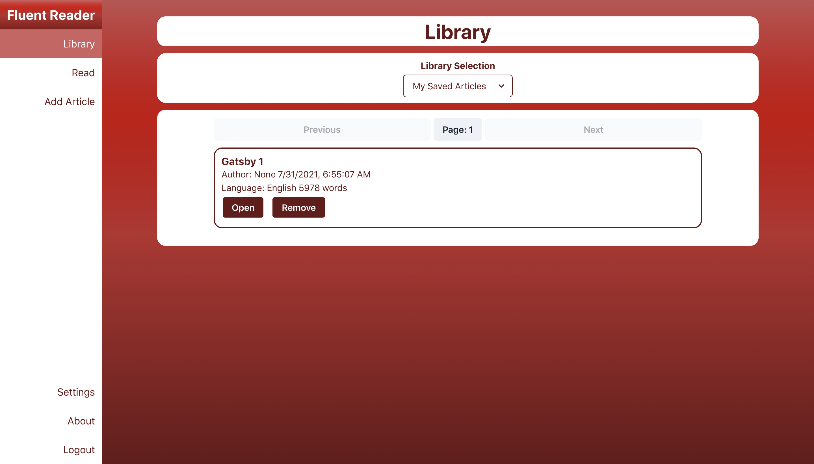
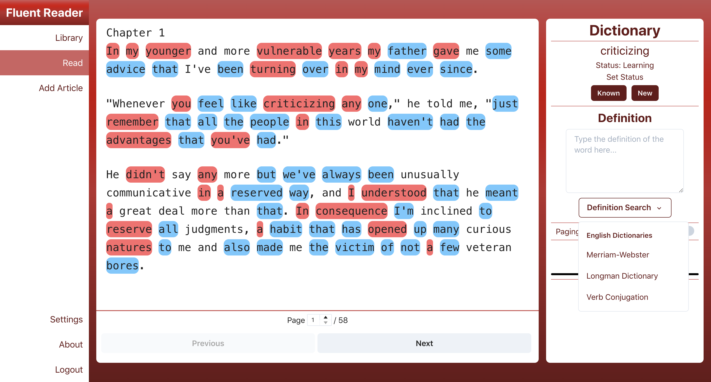
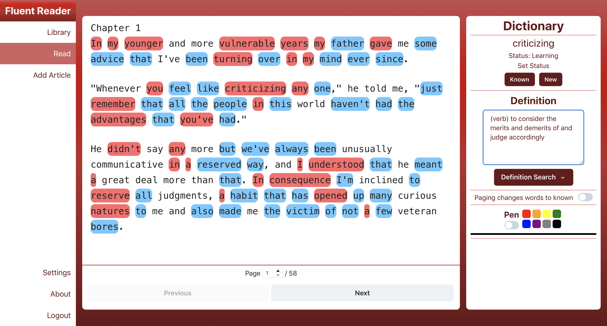
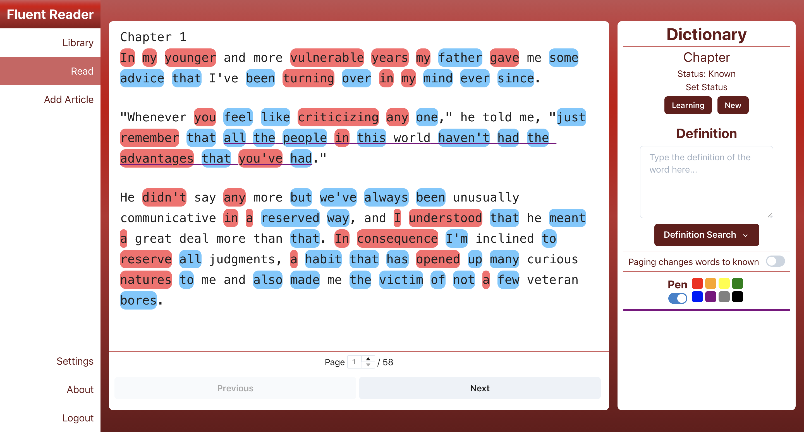
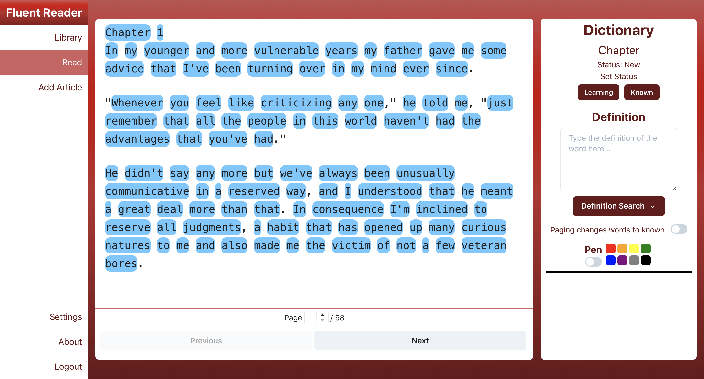
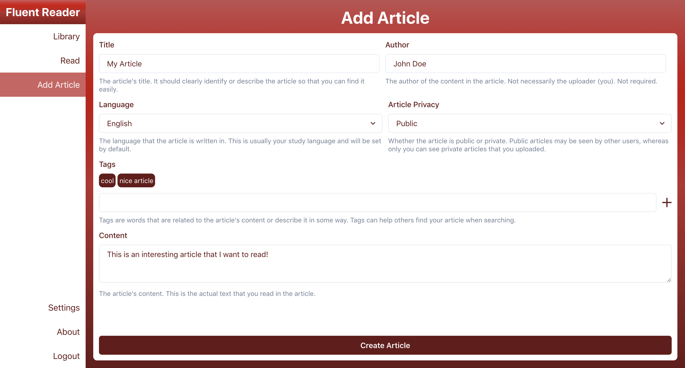
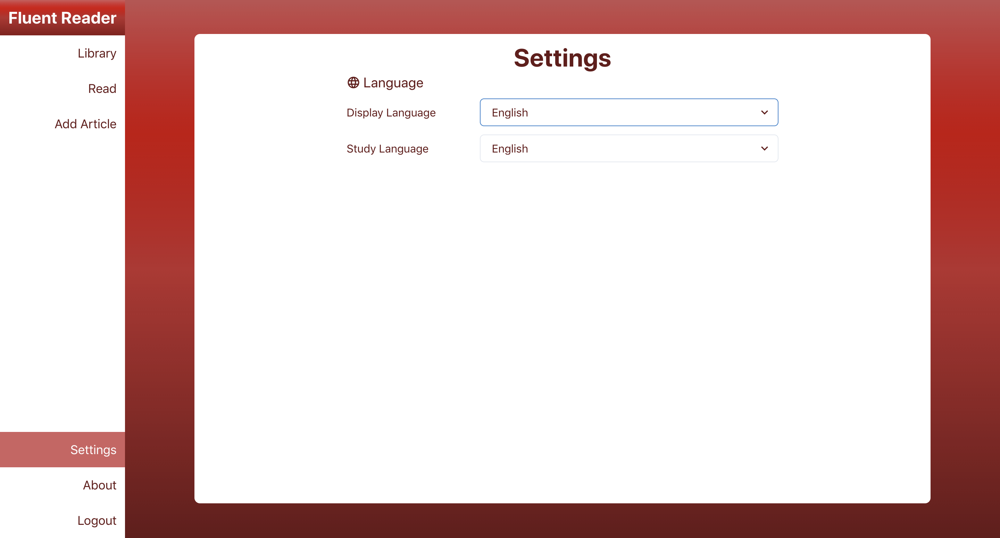

# User Manual

This document will serve as a guide on how to use Fluent Reader.

## Login

When you open up Fluent Reader for the first time, you will see the Login page.

You'll need to make an account before you can use the app. Click "Click here to sign up" to create an account.

## Account Creation

You'll need to fill a few details to make an account:

-   Username (used to login)
-   Display Name (the name other users will see)
-   Password (needs at least one lowercase letter, one upper case letter, and one number, must be at least 8 characters)
-   Confirm Password (the same as your password, retyped for confirmation)
-   Study Language (the language you want to use Fluent Reader to study, this can be changed later)
-   Display Language (the language you want Fluent Reader to be displayed in, this can be changed later)

When you're done typing in all the necessary information, click "Create Account" to continue. Note that if there is an error, your username or display name may be taken.

After making your account, you'll return back to the Login page, where you can type the information for your new account, and then login!

## Library

### Navigating the library

The library is used to find articles to read. There are four different types of libraries:

-   System Library: The System Library is a list of articles published officially by Fluent Reader
-   My Saved Articles: These are the articles you've saved from other libraries, gathered in one place
-   My Created Articles: These are all of the articles you've uploaded
-   All User Articles: This is a list of all articles uploaded by users. Any article that is not in the System Library will be here, and no articles in the System Library will be here

By default, the System Library is selected

You may also select other libraries, like the "All User Articles" library:

### Opening an article in the library

Once you've found an article you want to read, you can click "Open" to open it in the reader. (Skip to the Reader section to see more)

### Saving an article in the library

You can save articles from different libraries to store them in your "My Saved Articles" library by clicking "Save" on an article. It will then appear in the "My Saved Articles" library.

### Unsaving an article

You can remove an article from your "My Saved Articles" library by clicking "Remove". Note that this will not delete the article, and you may still find the same article in other libraries after removing.

## Reader

The Reader is the main page of the app. You can read articles in English or Chinese, look up words, and underline words and phrases you're interested in.

### Word Statuses

Fluent Reader stores a status for every word you study in the app. If you haven't seen a word before, it is a "New" word. If you've seen a word and looked it up, but don't completely know it yet, it is a "Learning" word. If you are completely familiar with a word and what it means, it is a "Known" word.

Words' statuses are indicated by their color. "New" words are highlighted in blue, "Learning" words are highlighted in red, and "Known" words are not highlighted.

You can change the status of a word by clicking the buttons under "Set Status". You can also double click a word to change its status.

### Searching for Word Definitions in the Dictionary

To look up a word you don't know, you can click on a word and it will open up in the Dictionary on the right side of the Reader. Then click the "Definition Search" button to open up a list of available dictionaries. Simply click a dictionary to open up the word's definition in that dictionary in a new tab in your browser.

Then you can copy the definition from the new tab and paste it into the definition box in the Dictionary. This will save the definition so that you can see it again when clicking on this same word in the future.

### Underlining words with the Pen

You can underline words and phrases in different colors using the Pen tool. To use it, simply click the switch under the text "Pen" in the dictionary, and click on the color you want to underline in.

To underline a single word, just click on that word after activating the Pen. If you want to underline more than one word, start a click on the first word you want to underline, and release the click on the last word you want to underline. This will underline every word from the first word until the last word as a phrase.

### First time using the Reader

When using the Reader for the first time, Fluent Reader doesn't know which words you know and which words you don't know, so you have to tell it. Upon opening up your first article, it will probably look something like this:

In order to let Fluent Reader get familiar with which words you know and which you don't you can first only click on, look up, and save definitions for words you don't know. Typing in definitions for these words will change their statuses to "Learning". Once you're done, click the "Paging changes words to known" button, and click "Next" at the bottom of the screen to move to the next page. This will change all of the remaining "New" words (those that you didn't look up) to "Known". If you continue to do this for every page, Fluent Reader will be familiar with all of the words you know in no time!

Note that the "Paging changes words to known" button will only change the statuses of "New" words to "Known", it does not modify any other word statuses. Remember to turn it off if you're just browsing the pages of the article, otherwise you may accidentally mark all of the words in the article as known!

## Importing a new article

You can also import articles that you want to read into Fluent Reader. To import an article, the following pieces of information are required:

-   Title
-   Language (the language the article is written in)
-   Content (the article's text itself)

And the following pieces of information are optional

-   Author
-   Privacy (public or private, other users can't see your private articles)
-   Tags (tags describing the article's content or related to its topic)

Once you've filled in all of the information of an article, you can click "Create Article" to add it to your library! Newly added articles will be added to your "My Saved Articles" library by default. They will also be in your "My Created Articles" and "All User Articles" libraries.

## Settings

### Changing your study language or display language

By navigating to the Settings page, you can change your study language (the language you want to read) or your display language (the language the app is displayed in). These are synced to your account and will be persisted when you log in at different places.

